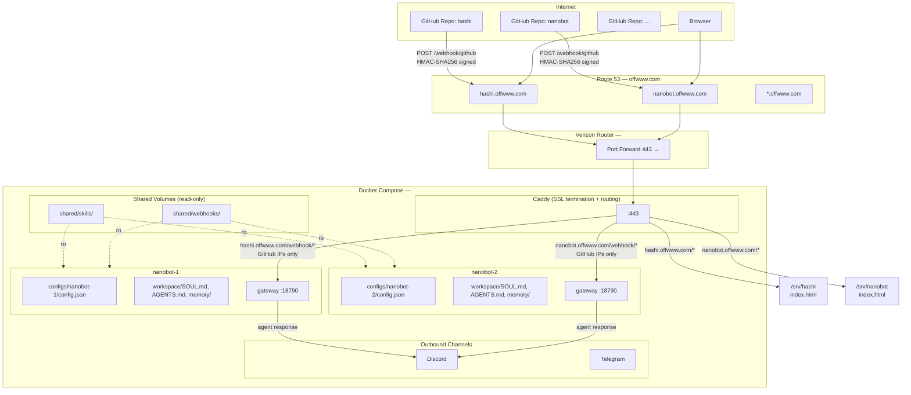
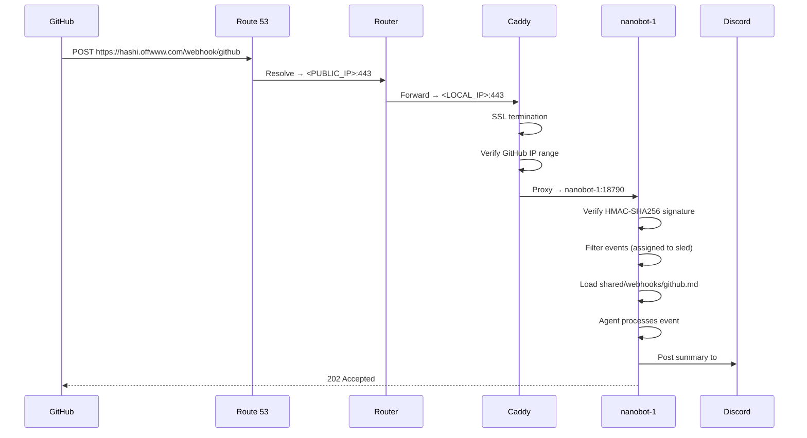

# Nanobot Instance Architecture

## Overview

Multi-instance nanobot deployment using Docker Compose. Each instance gets its own config, memory, and personality, while sharing skills and webhook templates.

## Architecture Diagram



## Request Flow



## Directory Structure

```
nanobot/
├── caddy/
│   ├── Caddyfile              # Routing + SSL config
│   └── site/
│       └── index.html         # Landing page (Spline logo)
├── secrets/
│   └── github-pat             # GitHub PAT for gh CLI (mounted :ro)
├── shared/
│   ├── skills/                # Shared across all instances (read-only mount)
│   └── webhooks/              # Shared webhook templates (github.md, etc.)
├── configs/
│   └── nanobot-1/
│       ├── config.json        # Per-instance (secrets, channels, model) — mounted :ro
│       ├── workspace/
│       │   ├── SOUL.md        # Per-instance personality
│       │   ├── AGENTS.md
│       │   ├── USER.md
│       │   └── memory/        # Per-instance memory
│       ├── cron/
│       ├── history/
│       └── sessions/
```

## Docker Compose Mounting Strategy

Each service mounts its per-instance config dir as the base `.nanobot` home, then overlays shared directories on top as read-only:

```yaml
services:
  nanobot-1:
    build: .
    volumes:
      - ./configs/nanobot-1:/root/.nanobot
      - ./configs/nanobot-1/config.json:/root/.nanobot/config.json:ro
      - ./shared/skills:/root/.nanobot/workspace/skills:ro
      - ./shared/webhooks:/root/.nanobot/workspace/webhooks:ro
    expose:
      - "18790"
```

## What's Shared vs Per-Instance

| Resource | Scope | Reason |
|---|---|---|
| `secrets/` | Shared | GitHub PAT and other secrets (mounted read-only) |
| `skills/` | Shared | Same capabilities across all instances |
| `webhooks/` | Shared | Same event handling templates |
| `config.json` | Per-instance | Secrets, channels, model selection (mounted read-only) |
| `SOUL.md` | Per-instance | Different personalities per bot |
| `AGENTS.md` | Per-instance | Different agent behavior |
| `USER.md` | Per-instance | Different user context |
| `memory/` | Per-instance | Isolated conversation memory |
| `sessions/` | Per-instance | Isolated session history |
| `cron/` | Per-instance | Different scheduled tasks |
| `history/` | Per-instance | Isolated command history |

## GitHub PAT (Personal Access Token)

Bots use the `gh` CLI for GitHub operations (issues, PRs, cloning). Authentication is handled via a classic PAT stored as a Docker secret.

### Token Setup

1. Generate a **classic PAT** at [GitHub → Settings → Developer settings → Personal access tokens → Tokens (classic)](https://github.com/settings/tokens)
2. Required scopes: **`repo`** (covers issues, PRs, cloning, API access)
3. Optional scopes: `read:org` (only if querying org-level data), `workflow`, `write:packages`
4. Save the token to `secrets/github-pat`

### How It Works

The `entrypoint.sh` loads the token into the environment before starting nanobot:

```sh
if [ -f /run/secrets/github-pat ]; then
    export GH_TOKEN=$(cat /run/secrets/github-pat)
fi
```

The secrets directory is mounted read-only into each container:

```yaml
volumes:
  - ./secrets:/run/secrets:ro
```

The `gh` CLI automatically picks up `GH_TOKEN` from the environment — no `gh auth login` needed.

### Verification

To verify the token works inside a running container:

```bash
docker compose exec nanobot-1 sh -c 'export GH_TOKEN=$(cat /run/secrets/github-pat) && gh auth status'
```

> **Note:** `docker compose exec` bypasses the entrypoint, so you need to load the token manually for ad-hoc commands. The main nanobot process has it set automatically.

## Security

- **SSL termination** — Caddy auto-provisions and renews Let's Encrypt certs
- **IP allowlist** — Only GitHub webhook IPs can reach `/webhook/*`
- **HMAC verification** — nanobot verifies `X-Hub-Signature-256` on every payload
- **Prompt injection defense** — Agent instructions forbid executing code or fetching URLs from payloads
- **Workspace restriction** — `restrictToWorkspace: true` limits file access
- **Read-only config** — `config.json` mounted `:ro` so agent can't modify secrets
- **Container isolation** — Each instance runs in its own container

## Adding a New Instance

1. Create Route 53 A record: `<name>.offwww.com` → `<PUBLIC_IP>`
2. Copy config dir: `cp -r configs/nanobot-1 configs/nanobot-N`
3. Edit `configs/nanobot-N/config.json` with new secrets and channel config
4. Update `SOUL.md`, `AGENTS.md`, `USER.md` for the new instance's personality
5. Add a new service block in `docker-compose.yml`
6. Add a new server block in `caddy/Caddyfile`
7. Add webhook in the GitHub repo pointing to `https://<name>.offwww.com/webhook/github`

## GitHub Webhook Setup

| Setting | Value |
|---|---|
| **Payload URL** | `https://hashi.offwww.com/webhook/github` |
| **Content type** | `application/json` |
| **Secret** | Value from `config.json` → `channels.webhook.sources.github.secret` |
| **Events** | Pushes, Pull requests, Issues, Issue comments |
| **Filter** | Only events assigned to "sled" (handled by agent instructions) |
| **Notify** | Discord `285944180587495424` (general) |
