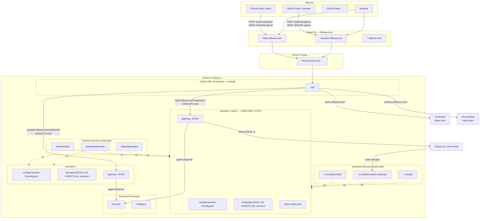
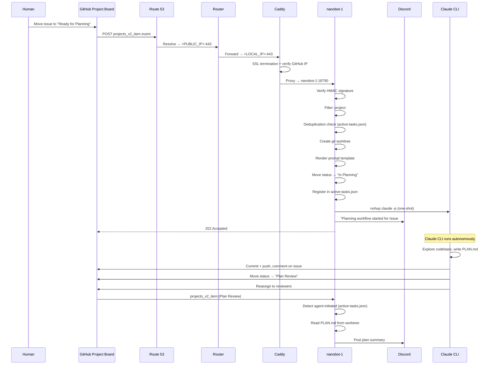

# Nanobot Instance Architecture

## Overview

Multi-instance nanobot deployment using Docker Compose. Each instance gets its own config, memory, and personality, while sharing skills, webhook templates, and prompt templates. nanobot-1 (codename "sled") handles the hashi project with automated GitHub workflow dispatch.

## Architecture Diagram



## Webhook-Driven Workflow Dispatch

nanobot-1 receives `projects_v2_item` webhook events from GitHub and dispatches workflows based on project board status changes. See [PROJECTFLOW.md](PROJECTFLOW.md) for the full status pipeline.

### Request Flow (Workflow Dispatch)



### Orchestration vs Execution Split

| Layer | Responsibility |
|-------|---------------|
| **Nanobot (orchestration)** | Webhook routing, deduplication, worktree management, template rendering, status transitions (before spawn), Discord notifications, cleanup, unblocking dependents |
| **Claude CLI (execution)** | All code changes, planning, TDD implementation, PR creation, status transitions (after completion), reassignment, issue comments |

Nanobot never writes code. It sets up the environment and fires off Claude CLI one-shots.

### Status → Workflow Routing

| Status | Trigger | Workflow | Superpowers Skill |
|--------|---------|----------|-------------------|
| Hold | Human | Notify Discord | — |
| Backlog | Human/Auto | Notify Discord | — |
| UI Prototyping | Human | No-op | — |
| Ready for Planning | Human | Planning | `writing-plans` |
| In Planning | Agent | No-op | — |
| Plan Review | Agent | Notify + plan summary | — |
| Ready for Dev | Human/Auto | Implementation | `executing-plans` + `test-driven-development` |
| In Development | Agent | No-op | — |
| Review | Agent | Self-review + notify | `requesting-code-review` |
| Done | Human | Verify + cleanup + unblock | `verification-before-completion` |

### Automatic Unblocking

When an issue moves to "Done", nanobot checks for dependent issues. If a dependent issue has all its blockers resolved and is sitting in "Backlog", it is automatically promoted to "Ready for Dev".

### UI Issues and Figma MCP

Issues with a "UI" label or UI-related keywords get the Figma MCP server enabled in their Claude CLI one-shot via `--mcp-config /root/figma-mcp.json`. The Figma MCP server runs on the host at `host.docker.internal:3845/mcp` and provides design context tools.

## Directory Structure

```
nanobot/
├── caddy/
│   ├── Caddyfile              # Routing + SSL config
│   └── site/
│       └── index.html         # Landing page
├── secrets/
│   └── github-pat             # GitHub PAT for gh CLI (mounted :ro)
├── shared/
│   ├── skills/                # Shared across all instances (read-only mount)
│   ├── webhooks/              # Shared webhook handler templates
│   │   └── github.md          # Webhook dispatch logic (projects_v2_item routing)
│   └── prompts/               # Claude CLI one-shot prompt templates
│       ├── planning-agent.md          # Planning workflow template
│       ├── impl-agent.md              # Implementation workflow template
│       └── planning-revision-agent.md # Plan revision workflow template
├── configs/
│   └── nanobot-1/
│       ├── config.json        # Per-instance config (channels, providers, tools)
│       ├── figma-mcp.json     # Figma MCP config for Claude CLI
│       ├── workspace/
│       │   ├── SOUL.md        # Per-instance personality
│       │   ├── AGENTS.md
│       │   ├── USER.md
│       │   ├── active-tasks.json  # Task registry for deduplication
│       │   └── memory/        # Per-instance memory
│       ├── cron/
│       │   └── jobs.json      # Cron jobs (currently empty — replaced by webhooks)
│       ├── history/
│       └── sessions/
├── docs/
│   ├── PROJECTFLOW.md         # Full project status pipeline
│   └── INSTANCE_SETUPS.md     # This file
├── docker-compose.yml
├── Dockerfile
└── entrypoint.sh
```

## Docker Compose Mounting Strategy

Each service mounts its per-instance config dir as the base `.nanobot` home, then overlays shared directories and host resources:

```yaml
services:
  nanobot-1:
    build: .
    volumes:
      # Per-instance config
      - ./configs/nanobot-1:/root/.nanobot
      - ./configs/nanobot-1/config.json:/root/.nanobot/config.json:ro
      # Shared resources (read-only)
      - ./shared/skills:/root/.nanobot/workspace/skills:ro
      - ./shared/webhooks:/root/.nanobot/workspace/webhooks:ro
      - ./shared/prompts:/root/prompts:ro
      - ./configs/nanobot-1/figma-mcp.json:/root/figma-mcp.json:ro
      # Host resources
      - ~/.claude:/root/.claude           # Claude CLI auth (read-write)
      - ./secrets:/run/secrets:ro         # GitHub PAT
      - ~/LocalDev/hashi:/root/hashi      # Hashi repo (read-write)
      - ~/LocalDev/hashi-worktrees:/root/hashi-worktrees  # Worktrees (read-write)
    deploy:
      resources:
        limits:
          cpus: '5'
          memory: 12G
        reservations:
          cpus: '1'
          memory: 2G
```

## What's Shared vs Per-Instance

| Resource | Scope | Reason |
|---|---|---|
| `secrets/` | Shared | GitHub PAT and other secrets (mounted read-only) |
| `skills/` | Shared | Same capabilities across all instances |
| `webhooks/` | Shared | Same event handling / dispatch templates |
| `prompts/` | Shared | Claude CLI one-shot prompt templates |
| `config.json` | Per-instance | Secrets, channels, model selection (mounted read-only) |
| `figma-mcp.json` | Per-instance | Figma MCP server config for Claude CLI |
| `active-tasks.json` | Per-instance | Workflow deduplication registry |
| `SOUL.md` | Per-instance | Different personalities per bot |
| `AGENTS.md` | Per-instance | Different agent behavior |
| `USER.md` | Per-instance | Different user context |
| `memory/` | Per-instance | Isolated conversation memory |
| `sessions/` | Per-instance | Isolated session history |
| `cron/` | Per-instance | Scheduled tasks (currently empty) |
| `history/` | Per-instance | Isolated command history |

## Key Configuration (nanobot-1)

### Webhook Config

```json
{
  "webhook": {
    "enabled": true,
    "port": 18790,
    "allowFrom": ["github"],
    "sources": {
      "github": {
        "allowEvents": ["push", "pull_request", "issues", "issue_comment", "projects_v2_item"],
        "requireAssignee": "sledcycle",
        "notifyChannel": "discord",
        "notifyChatId": "1476319678707011768"
      }
    }
  }
}
```

### Tool Config

```json
{
  "tools": {
    "exec": { "timeout": 300 },
    "restrictToWorkspace": false,
    "mcpServers": {
      "figma": { "url": "http://host.docker.internal:3845/mcp" }
    }
  }
}
```

## GitHub PAT (Personal Access Token)

Bots use the `gh` CLI for GitHub operations (issues, PRs, project board mutations). Authentication is handled via a classic PAT stored as a Docker secret.

### Token Setup

1. Generate a **classic PAT** at [GitHub Settings](https://github.com/settings/tokens)
2. Required scopes: **`repo`**, **`read:org`**, **`read:project`**, **`workflow`**, **`write:packages`**
3. Save the token to `secrets/github-pat`

### How It Works

The `entrypoint.sh` loads the token into the environment before starting nanobot:

```sh
if [ -f /run/secrets/github-pat ]; then
    export GH_TOKEN=$(cat /run/secrets/github-pat)
fi
```

The `gh` CLI automatically picks up `GH_TOKEN` from the environment.

### Claude CLI Authentication

Claude CLI uses the logged-in subscription account. The `~/.claude` directory is mounted read-write into the container so Claude CLI can read credentials and write session state. No API key needed.

## GitHub Project IDs (hashi)

| Entity | ID |
|--------|----|
| Project | `PVT_kwDODgSGac4BPTGn` (Project #9) |
| Status field | `PVTSSF_lADODgSGac4BPTGnzg9vz6Y` |
| Hold | `0ff6962c` |
| Backlog | `f75ad846` |
| UI Prototyping | `2359674f` |
| Ready for Planning | `99c0b68a` |
| In Planning | `15a164f6` |
| Plan Review | `d193658a` |
| Ready for Dev | `4cc28e6c` |
| In Development | `47fc9ee4` |
| Review | `3b449a1a` |
| Done | `98236657` |

## Security

- **SSL termination** — Caddy auto-provisions and renews Let's Encrypt certs
- **IP allowlist** — Only GitHub webhook IPs can reach `/webhook/*`
- **HMAC verification** — nanobot verifies `X-Hub-Signature-256` on every payload
- **Prompt injection defense** — Webhook handler forbids executing code or fetching URLs from payloads
- **Assignee filter** — Only processes events assigned to `sledcycle`
- **Read-only config** — `config.json` mounted `:ro` so agent can't modify secrets
- **Container isolation** — Each instance runs in its own container with resource limits
- **Deduplication** — `active-tasks.json` prevents duplicate workflow dispatch

## Adding a New Instance

1. Create Route 53 A record: `<name>.offwww.com` → `<PUBLIC_IP>`
2. Copy config dir: `cp -r configs/nanobot-1 configs/nanobot-N`
3. Edit `configs/nanobot-N/config.json` with new secrets and channel config
4. Update `SOUL.md`, `AGENTS.md`, `USER.md` for the new instance's personality
5. Add a new service block in `docker-compose.yml`
6. Add a new server block in `caddy/Caddyfile`
7. Add webhook in the GitHub repo pointing to `https://<name>.offwww.com/webhook/github`

## GitHub Webhook Setup

| Setting | Value |
|---|---|
| **Payload URL** | `https://hashi.offwww.com/webhook/github` |
| **Content type** | `application/json` |
| **Secret** | Value from `config.json` → `channels.webhook.sources.github.secret` |
| **Events** | Pushes, Pull requests, Issues, Issue comments, Projects v2 items |
| **Filter** | Only events assigned to "sledcycle" (handled by config + agent instructions) |
| **Notify** | Discord channel `1476319678707011768` |
